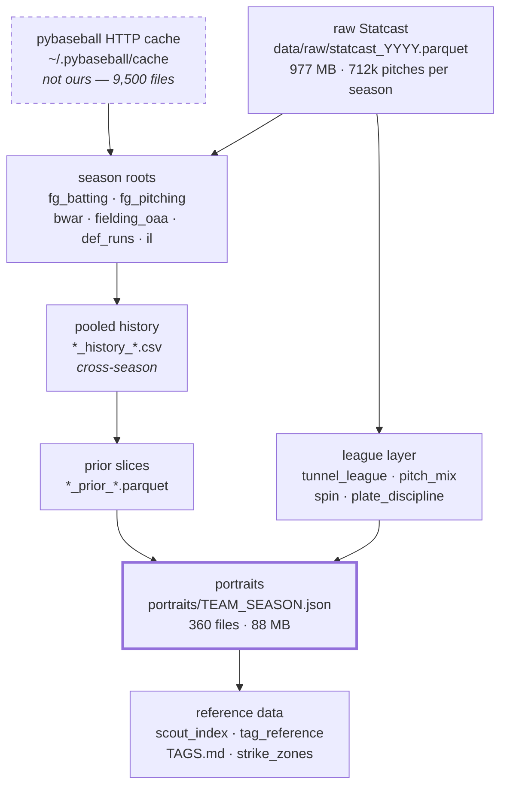
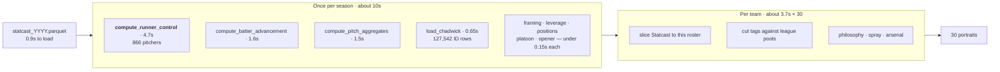
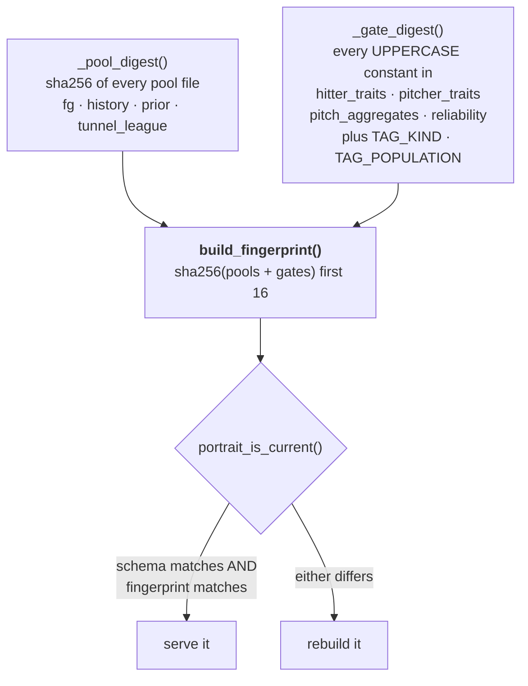
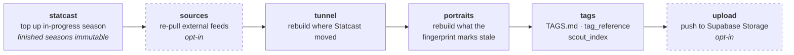
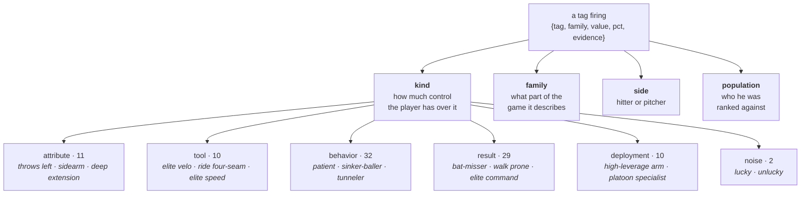
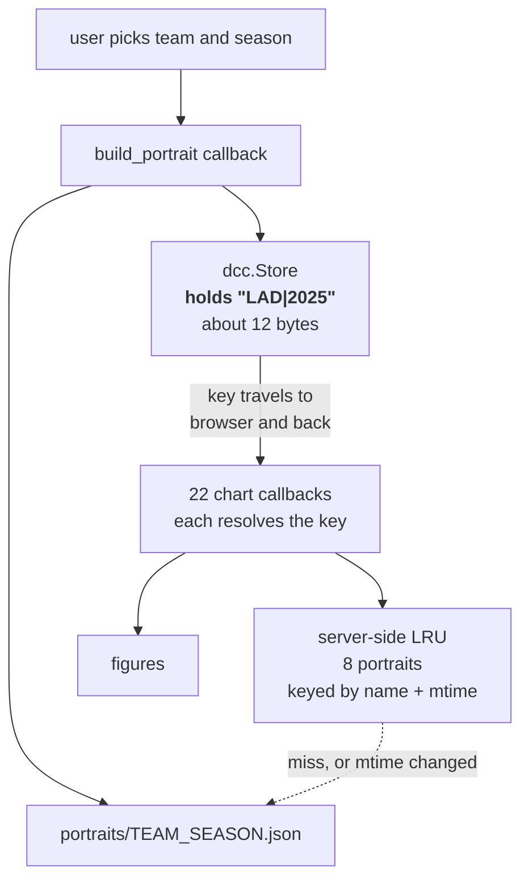
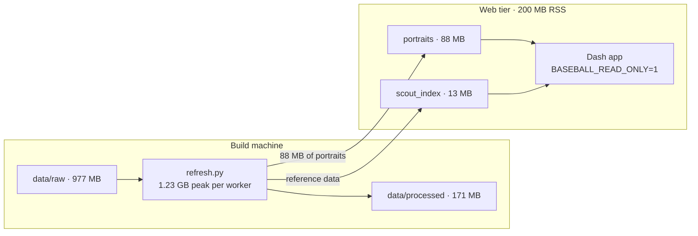

# Architecture

How data gets from Baseball Savant to a chart on screen, and why it is shaped
this way. For the runbook see [OPERATIONS.md](OPERATIONS.md); for the reasoning
behind specific choices see [DECISIONS.md](DECISIONS.md).

---

## The one-sentence version

Raw pitch data is boiled down, once, into a 239 KB JSON **portrait** per
team-season; the dashboard only ever reads portraits.

That split is the whole design. Building a portrait touches ~1.2 GB of
pitch-level Statcast. Serving one costs 200 MB of RAM and no raw data at all.
Everything below follows from keeping those two jobs apart.

---

## The cache stack

Five layers, and the outermost one is not ours. Each is derived from the one
above, which is why a stale layer higher up silently poisons everything below.

**The trap this causes.** Purging a middle layer rebuilds it from a stale root
and changes nothing. `repair_metric_units.py` sprang this twice before the
lesson stuck: repairing the database is not enough, because `team_portrait`
ranks players against pools cached on disk that keep whatever units they were
built with.

**The layer that is not ours.** `pybaseball` keeps its own HTTP cache, enabled
globally. Deleting our CSV and calling the puller again only reaches layer two
— pybaseball answers from its own store and writes back identical numbers. A
`sources` refresh once reported "6 refreshed, 0 failed" while changing nothing.
`refresh.py` now disables that cache for the duration of the stage.

---

## Building a portrait

`team_portrait.build_team_portrait(team, season)` runs 18 steps, but they split
into two kinds of work with very different costs.

Measured on 2025: first team 16.3s, every team after 3.6–4.4s. The league-wide
layer is memoised **in-process only**, so a fresh process pays for it again —
which is why a full 12-season rebuild is about 20 minutes rather than 2.

The team-specific work is irreducible. The league-wide work is a function of
that season's Statcast alone and, for a finished season, can never change.

---

## Staleness: the build fingerprint

A portrait is safe to serve only if it was built from the current data **and**
the current tag logic. Schema version alone cannot tell you that — it detects a
change of *shape*, and units or thresholds changing is a change of *content* at
the same shape. Thirty-one portraits once carried the current schema and
pre-repair units, and were served as valid cache hits.

**Two gaps this had, both now closed.** `tunnel_league_*.parquet` lives in
`modules/processed`, outside the glob, so tunnelling changes could not move the
fingerprint. And `pitch_aggregates` was absent from the gate digest despite
owning the strike-zone geometry behind zone%, chase%, CSW% and framing — so a
zone constant could change tag output invisibly.

**The known limitation.** The pool digest is global: it globs *every* season.
Topping up 2026 changes `tunnel_league_2026.parquet`, which changes the
fingerprint, which marks all 360 portraits stale — including 2015, whose
portrait never reads that file. Five days of new games therefore costs a
20-minute rebuild. A per-season pool digest would cut that to 30 portraits; the
complication is that philosophy scores normalise against a genuinely
cross-season pool, so that part legitimately spans all years.

---

## The refresh pipeline

One command, stages in dependency order. Two are opt-in because they are slow,
network-bound, or destructive.

Order is not optional — every stale-cache bug in this project came from running
it partially or out of sequence. Refusing to start while the dashboard is
listening on :8050 is a guard, not a courtesy: the dashboard is a writer on a
cache miss and can save a portrait built against half-regenerated pools.

---

## The tag taxonomy

Four independent axes. A tag is not a bucket a player sits in; it is a claim
about him that fired, carrying the evidence that earned it.

**Kind is ordered by control**, and that ordering is the point. An *attribute*
is a fact about the body — which side he throws from, how far down the mound he
gets before releasing. A *tool* is a physical capability that clears a bar:
97 mph, eighteen inches of induced vertical break. A *behavior* is a choice —
to sit on the first pitch, to lead with the sinker, to throw the slider out of
the same tunnel as the fastball. A *result* is what came of it: whiffs, walks,
weak contact. A *deployment* is the club's decision about him rather than his
about himself. *Noise* is the gap between what happened and what the contact
quality deserved.

It earns its keep when you read a roster. Three pitchers can all carry
`bat-misser` — a result — while one gets there on `elite velo` (a tool), one on
`tunneler` (a behavior), and one on nothing you can name, which is itself the
interesting case.

**Population is the denominator.** `elite framer` means nothing without "among
catchers with enough shadow-zone takes to measure". Nineteen populations exist
so that a percentile can say which pool it came from.

Tag definitions, gates and incidence counts live in
[TAGS.md](../baseball_construction/TAGS.md), which is generated from the live
maps and therefore cannot drift from the code.

---

## Serving

The dashboard reads portraits and nothing else. It holds no raw data, computes
no aggregates, and in a deployment writes nothing.

**Why a key and not the portrait.** Dash sends a `dcc.Store`'s contents back to
the server on every callback that reads it. With the portrait in the store, one
team switch uploaded **5.41 MB** — the same 286 KB payload sixteen times over.
With a key it is **11 KB**. The LRU is keyed by mtime as well as name, so a
rebuild underneath a running dashboard invalidates it rather than serving
whatever the process happened to load first.

**Scout and Compare do not read portraits at all.** They read
`scout_index.json`: all 18,664 player-seasons flattened into one 13 MB file
(1.9 MB gzipped) that loads in 0.1s and answers a tag query in 6 ms. That is
also what took the live database out of the serving path.

---

## Deployment topology

The two jobs want different machines.

Measured: the dashboard idles at 186 MB and reaches 200 MB after serving 37
portraits — flat, because the portrait goes to the browser rather than
accumulating server-side. A cache miss *without* `BASEBALL_READ_ONLY` would try
to download a full season and build it inside that container, which is why the
flag exists.

---

## Module map

| module | what it owns |
|---|---|
| `ingest.py` | every external pull, the season-date table, reliability weighting |
| `pitch_aggregates.py` | per-player Statcast aggregates, strike-zone geometry, framing |
| `team_portrait.py` | the 18-step build, the fingerprint, the tag vocabulary |
| `hitter_traits.py`, `pitcher_traits.py` | the gates that cut tags |
| `reliability.py` | stabilisation points, the refusal floor, limited-sample marking |
| `tunneling.py` | tunnel score from exact kinematics |
| `pitch_mix.py`, `spin_efficiency.py` | arsenal shape and spin |
| `philosophy.py`, `temporal.py`, `park_effects.py` | team-level context |
| `scripts/refresh.py` | the only writer |
| `dashboard/` | read-only presentation |

`hitter_archetypes.py` and `pitcher_archetypes.py` predate the tag taxonomy and
are no longer on the portrait path.
